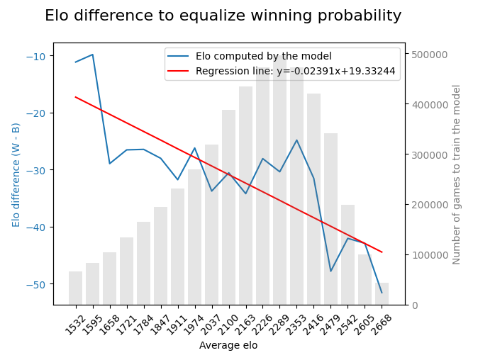

# WhiteAdvantage

How can we quantify white's advantage? Is it the same at every level? For every kind of game?
I analyzed two databases (classical games and online games)  and tried to quantify white's advantage based on regression models trained on the results obtained by players at different elo ranges and with different elo differences between black and white.

I approached the issue by asking two specific questions:
1. what is the difference in elo between white and black to have the same odds of winning?
2. If the two players have approximately the same elo score (+-50) what is white's probability of winning?

It turns out that white actually has an advantage and this advantage is more concrete among players with higher ratings and in the classic game mode. However, between players of the same level this advantage is practically constant as the players' average elo varies.

For instance, in a classical match, a 2100 elo player with the white pieces has the same probability to win if he plays against a 2130 with the black pieces. For two GMs the "balance elo difference" is about 40.

